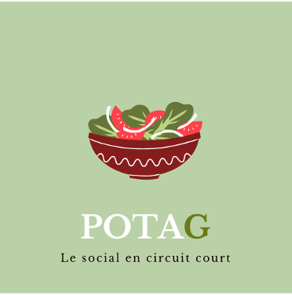

# PPII «Projet Pluridisciplinaire d'Informatique Intégrative» (2022-2023)

## PotaG - Le social en circuit court
<!-- LOGO DU PROJET -->

**Membres du groupe** :
- Thomas Gianelli <<thomas.gianelli@telecomnancy.eu>>  
- Maxence Bekhedda <<maxence.bekhedda@telecomnancy.eu>>  
- Léo Germain <<Leo.Germain@telecomnancy.eu>>  
- Théo Walter <<theo.walter@telecomnancy.eu>>  

## Description du projet

Notre objectif est de créer une application mettant en relation des particuliers produisant des fruits et légumes en nombre trop important pour leur consommation personnelle avec des acheteurs intéressés par la consommation de produits locaux.

L’exemple d’applications basées sur le circuit court comme Court-Circuit à Nancy montre que ce genre de démarche attire des clients. Cependant, elle emploie une méthode basées sur une unique boutique ce qui ne permet pas de généraliser ce procédé à l’échelle nationale. Plutôt qu’une boutique, notre application utilise des « cabanes » disposées stratégiquement contenant des casiers servant de point-relais entre les 2 parties.

L’interface de l’application contient deux parties distinctes :
- Un côté producteur contenant le profil du producteur, la possibilité de mettre en ligne des annonces et de voir l’historique de ses annonces. Il dispose également d’un tutoriel pour aider le producteur à utiliser l’application, ainsi que de le guider vers le casier dans lequel il doit déposer ses produits. Ils ont également la possibilité de poster des images de leurs produits et de leurs espaces de production, afin de se mettre en avant.

- Un côté acheteur ouvrant sur un fil d’offres semblables à un réseau social. Comme les producteurs, chaque acheteur possède un profil. Ces recommandations seront faites selon les récents achats de l’utilisateur, ainsi que de sa localisation (présente les offres les plus proches en premier) à l’aide de filtres. Les différentes offres contiennent le type de produit vendu, le profil du producteur et des recettes associées au produit mis en vente.
Il est également possible de donner un retour sur les produits achetés et d’interagir avec les producteurs via leurs posts. Les commentaires et les notes apparaissent dans le profil du producteur, lui permettant de gagner en visibilité.

